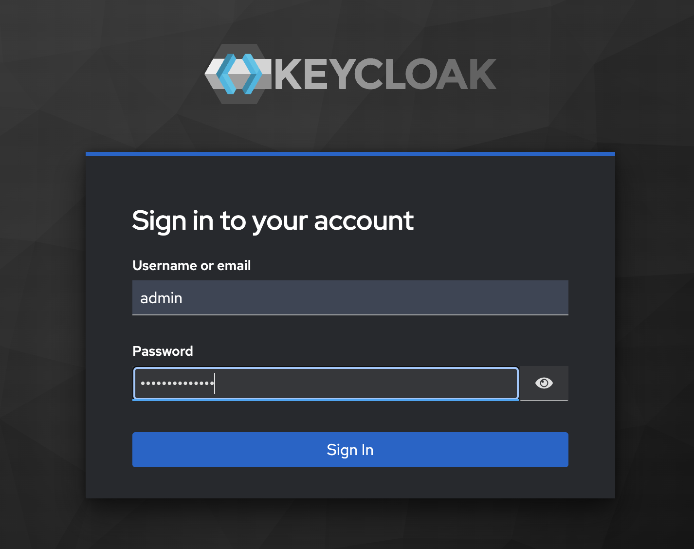
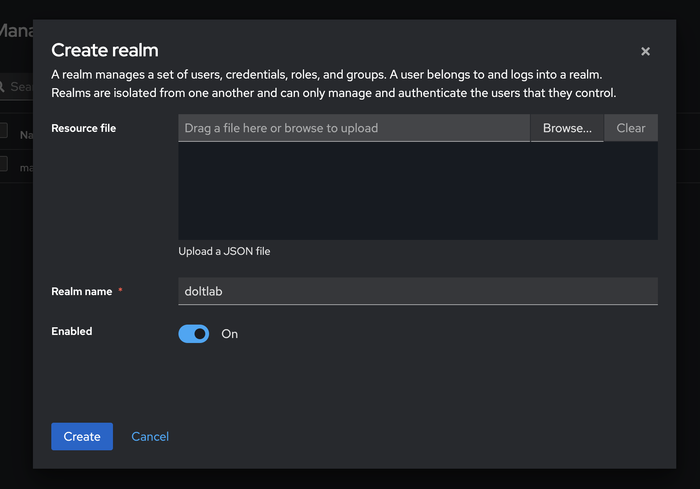
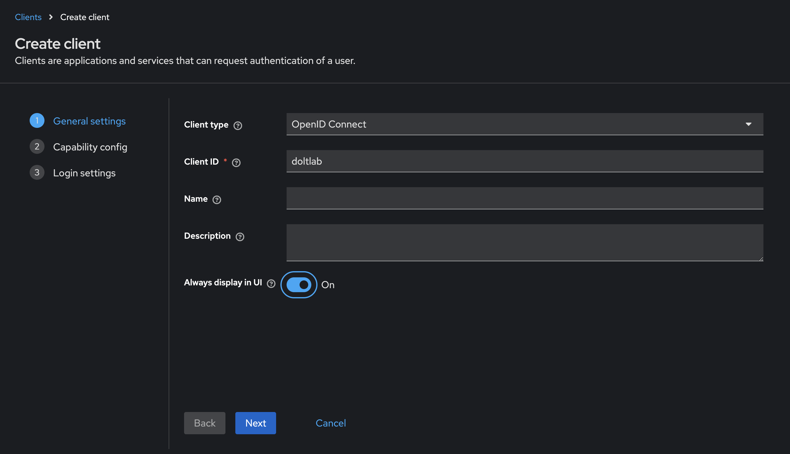
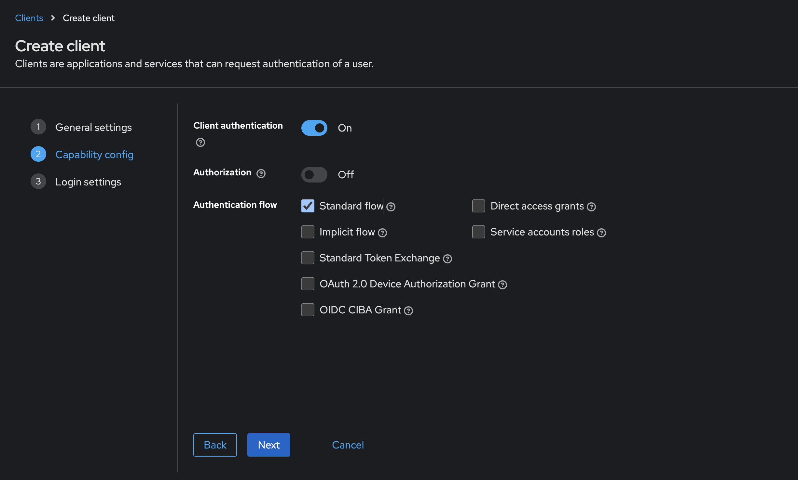
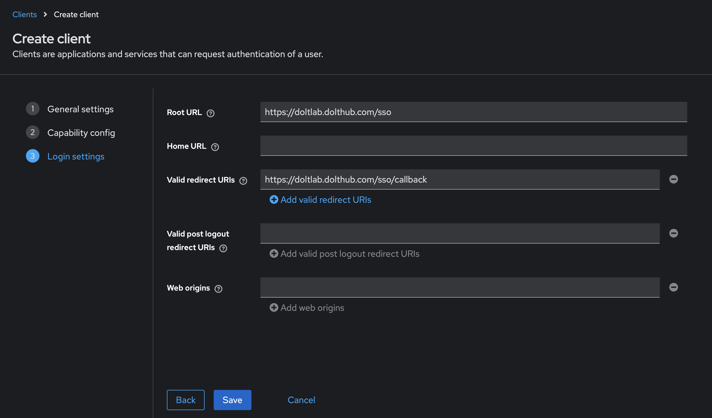
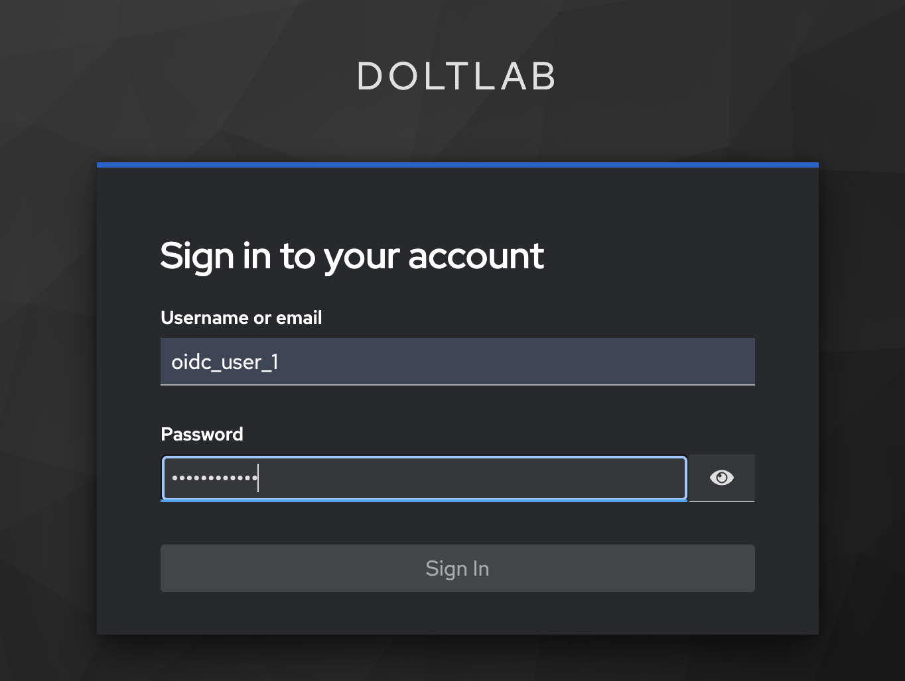

# Enterprise Administrator Guide

This guide will cover how to run DoltLab in Enterprise mode and use exclusive features not covered in the [Basic Administrator's Guide](./basic.md).

As of DoltLab >= v2.3.5, DoltLab Enterprise can either run in "online" mode or "offline" mode. In online mode, egress http traffic must be permitted on the DoltLab host as it relies on responses from an http server to verify the Enterprise license.

In offline mode, egress access on the host is not required. Instead, the DoltLab team will provide you a license file that must be present on the Enterprise host, and will be used to verify the Enterprise license.

## Configure Online Enterprise

To start DoltLab in online Enterprise mode, edit the `installer_config.yaml` file, supplying your Enterprise license keys using the online fields:

```yaml
enterprise:
  online_product_code: "yourproductcode"
  online_shared_key: "yoursharedkey"
  online_api_key: "yourapikey"
  online_license_key: "yourlicensekey"
```

Save these changes and rerun the [installer](../reference/installer.md) to regenerate DoltLab assets that allow it to run in Enterprise mode.

```bash
./installer
```

Alternatively, you can supply command line flags to the [installer](../reference/installer.md) like so:

```bash
./installer \
... \
--enterprise-online-product-code="yourproductcode" \
--enterprise-online-shared-key="yoursharedkey" \
--enterprise-online-api-key="yourapikey" \
--enterprise-online-license-key="yourlicensekey"
```

The values for these arguments will be provided to you by the DoltLab team. 

## Configure Offline Enterprise

To start DoltLab in offline Enterprise mode, edit the `installer_config.yaml` file, supplying your Enterprise license keys using the offline fields:

```yaml
enterprise:
  offline_product_code: "yourproductcode"
  offline_shared_key: "yoursharedkey"
  offline_api_key: "yourapikey"
  offline_license_key: "yourlicensekey"
  request_offline_activation: true
```

The values for these arguments will be provided to you by the DoltLab team. Additionally, set the field `request_offline_activation` to `true`. This tells the `installer` to generate an offline activation request file. 

Save these changes and run the `installer`.

```bash
./installer
```

The `installer` will generate a request file for offline activation. Provide this file to the DoltHub team.

```bash
2025-01-03T22:48:56.520Z	INFO	metrics/emitter.go:111	Successfully sent DoltLab usage metrics

2025-01-03T22:48:56.520Z	INFO	cmd/main.go:601	Please provide the generated offline activation request file to the DoltHub team:	{"file": "/home/ubuntu/doltlab/12345678_offline_activation.req"}
```

Once you provide the team with the activation request, they in turn will provide you with a valid offline license file.

Upload the file to the Enterprise host, then update the `installer_config.yaml` and replace the `request_offline_activation` field with the `offline_license_file` field. This field should specify the path to the license file.

```yaml
enterprise:
  offline_product_code: "yourproductcode"
  offline_shared_key: "yoursharedkey"
  offline_api_key: "yourapikey"
  offline_license_key: "yourlicensekey"
  offline_license_file: "/path/to/your/license/file"
```

Save these changes and rerun the `installer` to regenerate DoltLab assets that allow it to run in offline Enterprise mode.

```bash
./installer
```

The following contents on this page covers how to configure various Enterprise features for your DoltLab instance.

1. [Use custom Logo on DoltLab instance](#use-custom-logo-on-doltlab-instance)
2. [Customize automated emails](#customize-automated-emails)
3. [Customize DoltLab colors](#customize-doltlab-colors)
4. [Add Super Admins to a DoltLab instance](#add-super-admins-to-a-doltlab-instance)
5. [Configure SAML Single-Sign-on](#configure-saml-single-sign-on)
6. [Configure OIDC Single-Sign-on](#configure-oidc-single-sign-on)
7. [Automated Remote Backups](#automated-remote-backups)
8. [Deploy DoltLab across multiple hosts](#deploy-doltlab-across-multiple-hosts)
9. [Connect DoltLab to an SMTP server](#connect-doltlab-to-an-smtp-server)
10. [Connect DoltLab to an SMTP server with implicit TLS](#connect-doltlab-to-an-smtp-server-with-implicit-tls)
11. [Troubleshoot SMTP server connection problems](#troubleshoot-smtp-server-connection-problems)
12. [Set up a SMTP server using any Gmail address](#set-up-a-smtp-server-using-any-gmail-address)
13. [Serve DoltLab over HTTPS natively](#serve-doltlab-over-https-natively)
14. [Automatically upgrade DoltLab](#automatically-upgrade-doltlab)

# Use custom logo on DoltLab instance

DoltLab Enterprise allows administrators to customize the logo used across their DoltLab instance. At the time of this writing, custom logos custom logos must have a maximum height of `32px` and a maximum width of `240px`. They will be visible in the top navbar of every page and the footer of some pages, so therefore should work against dark backgrounds. If a custom logo is used on DoltLab, the footer of the DoltLab instance will display the text "Powered by DoltLab [version]" next to the custom logo.

You can use a custom logo on DoltLab by editing `./installer_config.yaml` and providing the path to your custom logo:

```yaml
# installer_config.yaml
enterprise:
  online_product_code: "yourproductcode"
  online_shared_key: "yoursharedkey"
  online_api_key: "yourapikey"
  online_license_key: "yourlicensekey"
  customize:
    logo: /absolute/path/to/custom/logo.png
```

Save these changes and rerun the [installer](../reference/installer.md) to regenerate DoltLab assets that use your custom logo.

```bash
./installer
```

Alternatively, you can run the [installer](../reference/installer.md) with the argument `--custom-logo=/absolute/path/to/custom/logo.png`.

You should see your new logo when you restart (`./start.sh`) your instance.

## Example

We'll use Starbucks as an example. First I need to find a logo that works well with a dark
background. I found a white Starbucks logo and copy that image file over to my DoltLab
host.

I create a `logos` folder on my host and use `scp` to securely copy my logo image.

```bash
$ scp ~/Desktop/starbucks-logo.png ubuntu@54.191.163.60:/home/ubuntu/logos
starbucks-logo.png
```

Note that this will not work if you create the `logos` folder while running `sudo newgrp docker`.

Once my image is there, I can add the absolute path to my image to the installer
configuration file.

```yaml
# installer_config.yaml
enterprise:
  # other enterprise config
  customize:
    logo: /home/ubuntu/logos/starbucks-logo.png
```

Once I save my changes, rerun the installer (`./installer`), and restart (`./start.sh`), I
should see my new Starbucks logo.


# Customize automated emails

DoltLab Enterprise allows administrators to customize the automated emails their DoltLab instance sends to its users.

Custom emails can be configured with the [installer](../reference/installer.md) by editing `./installer_config.yaml` and setting `enterprise.customize.email_templates` to `true`.

```yaml
# installer_config.yaml
enterprise:
  online_product_code: "yourproductcode"
  online_shared_key: "yoursharedkey"
  online_api_key: "yourapikey"
  online_license_key: "yourlicensekey"
  customize:
    email_templates: true
```

Save these changes and rerun the [installer](../reference/installer.md) to generate email template files you can customize, that DoltLab will use.

```bash
./installer
```

Alternatively, you can supply the argument `--custom-email-templates=true` to the [installer](../reference/installer.md) instead.

Once run, the [installer](../reference/installer.md) will generate the email template files at `./doltlabapi/templates/email` which match the files described below. You can customize these files and they will be used by DoltLab. Each file is named according to use-case. The names and paths of these files should NOT be changed.

- `collabInvite.txt` sent to invite user to be a database collaborator.
- `invite.txt` sent to invite a user to join an organization.
- `issueComment.txt` sent to notify user that an issue received a comment.
- `issueState.txt` sent to notify user that an issue's state has changed.
- `pullComment.txt` sent to notify user that a pull request received a comment.
- `pullCommits.txt` sent to notify user that a pull request received a commit.
- `pullReview.txt` sent to notify user that a pull request review's state has changed.
- `pullState.txt` sent to notify user that a pull request's state has changed.
- `recoverPassword.txt` sent to provide user with a link to reset their password.
- `resetPassword.txt` sent to notify a user that their password has been reset.
- `verify.txt` sent to a user to verify their email account.

To alter the text within one of the above files, we recommend only changing the hardcoded text between the [Actions](https://pkg.go.dev/text/template#hdr-Actions) and replacing the use of `{{.App}}`, which normally evaluates to "DoltLab", with the name of your company or team.

You should not change any template definitions, indicated with `{{define "some-template-name"}}` syntax, within these files as `doltlabapi` relies on these specific definitions.

To better illustrate how to modify these files, let's look at an example. Here is the default `verify.txt` template:

```
{{define "verifySubject" -}}
[{{.App}}] Please verify your email address.
{{- end}}

{{define "verifyHTML" -}}
<html>
	<body>
		<p>To secure access to your {{.App}} account, we need you to verify your email address: {{.Address}}.
		<p><a href="{{.BaseURL}}/users/{{.Username}}/emailAddresses/{{.Address}}/verify?token={{.Token}}">Click here to verify your email address.</a>
		<p>You’re receiving this email because you created a new {{.App}} account or added a new email address. If this wasn’t you, please ignore this email.
	</body>
</html>
{{- end}}

{{define "verifyText" -}}
Hi,

To secure access to your {{.App}} account, we need you to verify your email address: {{.Address}}.

Click the link below to verify your email address:

{{.BaseURL}}/users/{{.Username}}/emailAddresses/{{.Address}}/verify?token={{.Token}}

You're receiving the email because you created a new {{.App}} account or added a new email address. If this wasn't you, please ignore this email.
{{- end}}
```

Above, three templates are defined `verifySubject`, `verifyHTML`, and `verifyText`. We will not add or remove any of these templates and we won't change their names, but we will replace the `{{.App}}` field with the name of our company, Acme, Inc.'s DoltLab instance, "AcmeLab". We'll also modify the hardcoded text to be specific to our DoltLab instance's users.

After replacing `{{.App}}` with "AcmeLab", our file looks like:

```
{{define "verifySubject" -}}
[AcmeLab] Please verify your email address.
{{- end}}

{{define "verifyHTML" -}}
<html>
	<body>
		<p>To secure access to your AcmeLab account, we need you to verify your email address: {{.Address}}.
		<p><a href="{{.BaseURL}}/users/{{.Username}}/emailAddresses/{{.Address}}/verify?token={{.Token}}">Click here to verify your email address.</a>
		<p>You’re receiving this email because you created a new AcmeLab account or added a new email address. If this wasn’t you, please ignore this email.
	</body>
</html>
{{- end}}

{{define "verifyText" -}}
Hi,

To secure access to your AcmeLab account, we need you to verify your email address: {{.Address}}.

Click the link below to verify your email address:

{{.BaseURL}}/users/{{.Username}}/emailAddresses/{{.Address}}/verify?token={{.Token}}

You're receiving the email because you created a new AcmeLab account or added a new email address. If this wasn't you, please ignore this email.
{{- end}}
```

Lastly, let's customize this email with the contact information of our AcmeLab admin, in case users have any questions. We want to add the same
information to the `verifyHTML` template and the `verifyText` template so that it appears for either supported email format:

```
{{define "verifySubject" -}}
[AcmeLab] Please verify your email address.
{{- end}}

{{define "verifyHTML" -}}
<html>
	<body>
    <p>Thank you for signing up for AcmeLab!
		<p>To secure access to your AcmeLab account, we need you to verify your email address: {{.Address}}.
		<p><a href="{{.BaseURL}}/users/{{.Username}}/emailAddresses/{{.Address}}/verify?token={{.Token}}">Click here to verify your email address.</a>
		<p>You’re receiving this email because you created a new AcmeLab account or added a new email address. If this wasn’t you, please ignore this email.
    <p> If you need further assistance, please reach out to Kevin at kevin@acmeinc.com.
	</body>
</html>
{{- end}}

{{define "verifyText" -}}
Thank you for signing up for AcmeLab!

To secure access to your AcmeLab account, we need you to verify your email address: {{.Address}}.

Click the link below to verify your email address:

{{.BaseURL}}/users/{{.Username}}/emailAddresses/{{.Address}}/verify?token={{.Token}}

You're receiving the email because you created a new AcmeLab account or added a new email address. If this wasn't you, please ignore this email.

If you need further assistance, please reach out to Kevin at kevin@acmeinc.com.

{{- end}}
```

Once we save our edits, we can restart our DoltLab instance for the changes to take affect.

# Customize DoltLab colors

DoltLab Enterprise allows administrators to customize the color of certain assets across
their DoltLab instance. This is current list of colors that you can customize and what
they are used for:

- `accent_1`: An accent color used sparingly to highlight certain features, such as active tabs.
- `background_accent_1`: An accent background color used often for headers. As the primary
  background color for DoltLab is white/grey and not configurable, is expected that is
  color is dark enough to work with light or white text.
- `background_gradient_start`: A background color used to create a gradient for some
  headers in combination with `background_accent_1`. If you do not want a gradient you can
  use the same value as `background_accent_1`.
- `button_1`: Primary button color.
- `button_2`: Secondary button color, used for hover states.
- `link_1`: Primary link color.
- `link_2`: Secondary link color, used for hover states.
- `link_light`: Tertiary link color, used for links on dark backgrounds.
- `primary`: Primary text color, also used for some outlines.
- `code_background`: Dark background color for code blocks.

Here is a visual guide for where customizable colors are used on the database
page on DoltLab:


In order to configure these customized colors, you'll need the
[RGB](https://en.wikipedia.org/wiki/RGB_color_model) value of each color. Each color value
must include three comma-separated colors. We use dynamic [Tailwind
themes](https://tailwindcss.com/docs/theme) to implement these custom colors. You can
learn more about the specifics of how this is implemented
[here](https://www.dolthub.com/blog/2024-03-20-dynamic-tailwind-themes/).

Once you decide on the color palette, edit the `./installer_config.yaml`, adding:

```yaml
enterprise:
  online_product_code: "yourproductcode"
  online_shared_key: "yoursharedkey"
  online_api_key: "yourapikey"
  online_license_key: "yourlicensekey"
  customize:
    color_overrides:
      rgb_accent_1: "252, 66, 201"
      rgb_background_accent_1: "24, 33, 52"
      rgb_background_gradient_start: "31, 41, 66"
      rgb_button_1: "61, 145, 240"
      rgb_button_2: "31, 109, 198"
      rgb_link_1: "31, 109, 198"
      rgb_link_2: "61, 145, 240"
      rgb_link_light: "109, 176, 252"
      rgb_primary: "0, 0, 0"
      rgb_code_background: "24, 33, 52"
```

Save these changes and rerun the [installer](../reference/installer.md) to regenerate DoltLab assets that use your custom colors.

```bash
./installer
```

Alternatively, you can run the [installer](../reference/installer.md) with the following arguments corresponding to the custom color you want to override:

```bash
./installer \
... \
--custom-color-rgb-accent-1="252, 66, 201" \
--custom-color-rgb-background-accent-1="24, 33, 52" \
--custom-color-rgb-background-gradient-start="31, 41, 66" \
--custom-color-rgb-button-1="61, 145, 240" \
--custom-color-rgb-button-2="31, 109, 198" \
--custom-color-rgb-link-1="31, 109, 198" \
--custom-color-rgb-link-2="61, 145, 240" \
--custom-color-rgb-link-light="109, 176, 252" \
--custom-color-rgb-primary="0, 0, 0" \
--custom-color-rgb-code-background="24, 33, 52"
```

You should see your new colors when you restart (`./start.sh`) your instance.

## Example

Using Starbucks as an example again, we use their [color
guide](https://creative.starbucks.com/color/) to choose some colors to brand our DoltLab
and then add them to the installer configuration.

```yaml
# installer_config.yaml
enterprise:
  # other enterprise config
  customize:
    logo: /home/ubuntu/logos/starbucks-logo.png
    color_overrides:
      rgb_accent_1: "219, 168, 61"
      rgb_background_accent_1: "41, 96, 68"
      rgb_background_gradient_start: "50, 115, 78"
      rgb_button_1: "50, 115, 78"
      rgb_link_1: "50, 115, 78"
      rgb_button_2: "41, 96, 68"
      rgb_link_2: "41, 96, 68"
      rgb_link_light: "216, 232, 226"
      rgb_primary: "36, 56, 50"
      rgb_code_background: "41, 96, 68"
```

I rerun the installer and restart:

```bash
$ ./installer
$ ./start.sh
```

And now DoltLab is Starbucks branded!


See other examples of utilizing colors to brand DoltLab for some well-known companies
[here](https://dolthub.awsdev.ld-corp.com/blog/2024-05-23-customizing-doltlab-colors/#other-examples).

# Add Super Admins to a DoltLab instance

DoltLab Enterprise allows administrators to specify users who will be "super admins" on their DoltLab instance.

A DoltLab "super admin" is a user granted unrestricted access and the highest possibly permission level on all organizations, teams, and databases on a DoltLab instance. This allows these users to write to any database, public or private, merge pull-requests, delete databases and add or remove organization/team members. By default there are no "super admins" registered on a DoltLab instance, including the default user `admin`.

Super admins can be configured by editing the `./installer_config.yaml` file and specifying the email addresses for users you want to be super admins.

```yaml
# installer_config.yaml
enterprise:
  online_product_code: "yourproductcode"
  online_shared_key: "yoursharedkey"
  online_api_key: "yourapikey"
  online_license_key: "yourlicensekey"
  super_admins: ["me@email.com", "you@email.com"]
```

Alternatively, you can use the [installer](../reference/installer.md) with the argument `--super-admin-email` instead. This argument can be supplied multiple times, for example:

```bash
./installer \
...
--super-admin-email=me@email.com \
--super-admin-email=you@email.com
```

# Configure SAML Single-Sign-On

DoltLab Enterprise supports SAML single-sign-on. To configure your DoltLab instance to use SAML single-sign-on, you will first need an Identity Provider (IP) to provide you with a metadata descriptor.

For example, [Okta](https://www.okta.com/), a popular IP, provides an endpoint for downloading the metadata descriptor for a SAML application after you register an application on their platform.


During registration, Okta will ask you for the "Single Sign On Url" and an "Audience Restriction" for the application.

Use the domain/host IP address of your DoltLab instance followed by `/sso/callback` for the "Single Sign On Url", and use that same domain/host IP address followed by just "/sso" for the "Audience Restriction". Since this example will be for `https://doltlab.dolthub.com`, we'll use `https://doltlab.dolthub.com/sso/callback` and `https://doltlab.dolthub.com/sso` respectively.


Be sure to also set "Name ID Format" to "Persistent".

Then, download the metadata Okta provides for this application to your DoltLab host.

Next, edit `./installer_config.yaml` with the path to the metadata descriptor and the common name to use when generating the saml certificate.

```yaml
# installer_config.yaml
enterprise:
  online_product_code: "yourproductcode"
  online_shared_key: "yoursharedkey"
  online_api_key: "yourapikey"
  online_license_key: "yourlicensekey"
  saml:
    metadata_descriptor_file: "/absolute/path/to/downloaded/metadata/descriptor"
    cert_common_name: "mydoltlabinstance"
```

Save these changes and rerun the [installer](../reference/installer.md) to regenerate DoltLab assets the enable saml single-sign-on.

```bash
./installer
```

Alternatively, the [installer](../reference/installer.md) can be run with the following arguments to do the same thing:

```bash
./installer \
...
--sso-saml-metadata-descriptor=/absolute/path/to/downloaded/metadata/descriptor \
--sso-saml-cert-common-name="mydoltlabinstance"
```

When SAML single-sign-on is configured, you will see the SAML option on the sign-in page:


Next, as user `admin`, login to your DoltLab instance and navigate to `Profile` > `Settings` > `SSO`.


On this tab you will see the following:


`Assertion Consumer Service Url` displays the url where Okta should send the SAML assertion.

`Entity ID/Login Url` displays the url users can use to login to DoltLab using the IP, but they can now simply use the option available on the sign-in page.

`IP Metadata Descriptor` is a metadata descriptor for this DoltLab instance, and can be downloaded and supplied to the IP if it requires service providers to upload metadata.

`Certificate` can be downloaded if you want to add a signature certificate to the IP to verify the digital signatures.

Your Enterprise instance will now use single-sign-on through your IP for user login and account creation.

# Configure OIDC Single-Sign-On

DoltLab Enterprise >= v2.3.14 supports OIDC single sign on. To configure your DoltLab Enterprise instance to use OIDC single-sign-on, obtain an OIDC `client_id` and `client_secret` from your Identity Provider (IP).

For this example, we will use [Keycloak]() as our Identity Provider. To obtain a `client_id` and `client_secret`, we first create a Client.

To do so, first we'll sign in as the `admin`, then create a new Realm, or namespace.





We've created the realm called `doltlab`. Next, we can create an OIDC Client by filling out the Create Client forms. It is important that we also make sure we select the Standard Flow and enable Client Authentication at screen two.







As you can see from the screenshots above, we've chosen `doltlab` to be our `client_id`.

For the Root url, we enter the hostname or IP address of our DoltLab Enterprise instance, followed by the `/sso` path. For this example, this is `https://doltlab.dolthub.com/sso`.

For the Redirect url, we do the same thing we did for Root url, only now the path is `/sso/callback`. This makes our Redirect url `https://doltlab.dolthub.com/sso/callback`.

After we've created the Client, navigating to the Credentials tab will allow us to copy our `client_secret`. We will use both the `client_id` and `client_secret` to configure our DoltLab Enterprise instance to use OIDC now.

To do so, first stop your DoltLab Enterprise instance using the `./stop.sh` script. Then, edit the `installer_config.yaml` and add an `oidc` block to the `enterprise` block like so:

```yaml
enterprise:
  oidc:
    issuer_url: https://mykeycloakdeployment.com/realms/doltlab
    client_id: doltlab
    client_secret: **********
```

In this `oidc` block, add the three required fields, `issuer_url`, `client_id`, and `client_secret`. For Keycloak, we must specify the realm where we've configure OIDC, so our issuer url is:
`https://mykeycloakdeployment.com/realms/doltlab`.

We've then pasted our `client_id` and corresponding `client_secret` into the two remaining fields.

Now we can restart our DoltLab Enterprise deployment with the `./start.sh` script.

When DoltLab comes back up, a link to sign-in with the IP will be displayed at the Sign-in page. When users click this link, they will be redirected to the IP to sign-in.



After signing in with the IP, they'll be redirected to your DoltLab Enterprise instance and successfully logged in!

# Automated Remote Backups

DoltLab Enterprise supports automated database backups for DoltLab's application Dolt server. To backup database data of all the Dolt databases hosted on your DoltLab instance, we recommend taking regular snapshots of the host's filesystem.

To configure your DoltLab instance to automatically back up its Dolt database server, first, provision either a GCP bucket or and AWS S3 bucket and Dynamo DB table. You will need these to resources to create a remote backup. Oracle Cloud Infrastucture (OCI) storage buckets may be used as well.

Dolt supports a [backup](https://docs.dolthub.com/sql-reference/server/backups#dolt-backup-command) command which can be used to create backups of a Dolt instance.

Let's walk through setting up automated backups using an AWS remote backup first.

## AWS Remote Backup

Dolt can use an [AWS Remote](https://www.dolthub.com/blog/2021-07-19-remotes/) as a backup destination, but requires that two resources be provisioned. As stated in [this helpful blog post](https://www.dolthub.com/blog/2021-07-19-remotes/#aws-remotes), "AWS remotes use a combination of Dynamo DB and S3. The Dynamo table can be created with any name but must have a primary key with the name `db`."

For our example, let's create an AWS S3 bucket called `test-doltlab-application-db-backups`.


Let's also create a Dynamo DB table in the same AWS region, and call it `test-doltlab-backup-application-db-manifest`. Notice its uses the required partition key (primary key) `db`.


The AWS remote url for our DoltLab instance which is determined by the template `aws://[dolt_dynamo_table:dolt_remotes_s3_storage]/backup_name`, will be `aws://[test-doltlab-backup-application-db-manifest:test-doltlab-application-db-backups]/my_doltlab_backup`.

We've also granted read and write access for these resources to an IAM role called `DoltLabBackuper`.

It's now time to update our DoltLab instance configuration to automatically backup it's Dolt server data to our AWS remote.

First, ensure that the AWS credentials on the DoltLab host can be used to assume the role `DoltLabBackuper`. Create a AWS config file that contains:

```
[profile doltlab_backuper]
role_arn = arn:aws:iam::<aws account number>:role/DoltLabBackuper
region = <aws region>
source_profile = default
```

Then use the AWS CLI to confirm this profile can be used on your DoltLab host:

```
AWS_SDK_LOAD_CONFIG=1 \
AWS_REGION=<aws region> \
AWS_CONFIG_FILE=<path to config file> \
AWS_SDK_LOAD_CONFIG=1 \
AWS_PROFILE=doltlab_backuper \
aws sts get-caller-identity
{
    "UserId": "<user id>:botocore-session-1700511795",
    "Account": <aws account number>,
    "Arn": "arn:aws:sts::<aws account number>:assumed-role/DoltLabBackuper/botocore-session-1700511795"
}
```

Next, edit the `./installer_config.yaml` file to configure automated backups.

```yaml
# installer_config.yaml
enterprise:
  online_product_code: "yourproductcode"
  online_shared_key: "yoursharedkey"
  online_api_key: "yourapikey"
  online_license_key: "yourlicensekey"
  automated_backups:
    remote_url: "aws://[test-doltlab-backup-application-db-manifest:test-doltlab-application-db-backups]/my_doltlab_backup"
    aws_region: "aws-region"
    aws_profile: "doltlab_backuper"
    aws_shared_credentials_file: "/absolute/path/to/aws/credentials"
    aws_config_file: "/absolute/path/to/aws/config"
```

Save these edits and rerun the [installer](../reference/installer.md) to regenerate DoltLab assets that will automatically backup `doltlabdb` to AWS.

```bash
./installer
```

Alternatively, run the [installer](../reference/installer.md) with the following arguments to configure the AWS backup:

```bash
./installer \
...
--automated-dolt-backups-url="aws://[test-doltlab-backup-application-db-manifest:test-doltlab-application-db-backups]/my_doltlab_backup" \
--aws-shared-credentials-file="/absolute/path/to/aws/credentials" \
--aws-config-file="/absolute/path/to/aws/config" \
--aws-region="aws-region" \
--aws-profile="doltlab_backuper"
```

DoltLab will use a combination of Prometheus and Alertmanager to notify you if your regularly scheduled backup fails for some reason. You'll need to edit the Alertmanager configuration file generated by the [installer](../reference/installer.md) at `./alertmanager/alertmanager.yaml` and include your SMTP authentication information in the `global` section. The other sections do not need to be edited:

```yaml
global:
  smtp_from: no-reply@example.com
  smtp_auth_username: my-username
  smtp_auth_password: ******
  smtp_smarthost: smtp.gmail.com:587

receivers:
  - name: doltlab-admin-email
    email_configs:
      - to: me@example.com
        send_resolved: true

route:
  receiver: "doltlab-admin-email"
  group_wait: 30s
  group_interval: 2m
  repeat_interval: 4h
  routes:
    - receiver: "doltlab-admin-email"
      group_by: [alertname]
      matchers:
        - app =~ "backup-syncer"
        - severity =~ "page|critical"
```

For more configuration options, please consult the [AlertManager documentaion](https://prometheus.io/docs/alerting/latest/configuration/).

Finally, start DoltLab using the `./start.sh` script. DoltLab will create the first backup when started, and by default, will create backups at midnight each night. You will see your backups stored in your S3 bucket, and the manifest stored in your DynamoDB table.


Your DoltLab's Dolt server is now automatically backing up to your AWS remote.

## GCP Remote Backup

To backup DoltLab's Dolt server to a GCP remote, first create a bucket in GCP. This will be the only required resource needed.


Next, add GCP JSON credentials to your DoltLab host. You can find information about GCP credentials [here](https://cloud.google.com/sdk/gcloud/reference/auth/application-default/login).

Following the Dolt's url template for GCP remotes as outlined in [this blog](https://www.dolthub.com/blog/2021-07-19-remotes/#gcp-remotes), the remote url we will use for this bucket will be `gs://test-doltlab-application-db-backup/my_doltlab_backup`.

Next, edit `./installer_config.yaml` and supply your GCP remote information.

```yaml
# installer_config.yaml
enterprise:
  online_product_code: "yourproductcode"
  online_shared_key: "yoursharedkey"
  online_api_key: "yourapikey"
  online_license_key: "yourlicensekey"
  automated_backups:
    remote_url: "gs://test-doltlab-application-db-backup/my_doltlab_backup"
    google_credentials_file: "/absolute/path/to/gcloud/credentials"
```

Save these edits and rerun the [installer](../reference/installer.md) to regenerate DoltLab assets that will automatically backup `doltlabdb` to AWS.

```bash
./installer
```

Alternatively, run the [installer](../reference/installer.md) with the following arguments to create automated GCP backups:

```bash
./installer \
...
--automated-dolt-backups-url="gs://test-doltlab-application-db-backup/my_doltlab_backup" \
--google-creds-file="/absolute/path/to/gcloud/credentials"
```

Finally, edit the `./alertmanager/alertmanager.yaml` file generated by the [installer](../reference/installer.md), as shown in the AWS backups section, to receive notifications of backup failures.

Once you start your Enterprise instance with `./start.sh`, it will now automatically back up its application Dolt server to your GCP bucket.


## OCI Remote Backup

To backup DoltLab's Dolt server to an OCI remote, first create a bucket in OCI. This will be the only required resource needed.


Next, install the `oci` CLI tool on your DoltLab host, and run `oci setup config` to create a configuration file with credentials authorized to access your bucket. You can find information about creating an config file [here](https://docs.oracle.com/en-us/iaas/Content/API/SDKDocs/cliinstall.htm#configfile).

`oci setup config` will create a config file and private key file that you will then need to mount into the `doltlabdb` container.

First, edit the generated config file so that the `key_file` field contains the absolute path of where the generate key file will be mounted in the `doltlabdb` container.

```
[DEFAULT]
user=ocid1.user.oc1..<unique_ID>
fingerprint=<your_fingerprint>
key_file=/oci_private_key.pem
tenancy=ocid1.tenancy.oc1..<unique_ID>
region=us-ashburn-1
```

In the above example, we've changed `key_file` to point to `/oci_private_key.pem`, where DoltLab will mount the private key file. Save these changes.

Following the Dolt's url template for OCI remotes as outlined in [this blog](https://www.dolthub.com/blog/2021-07-19-remotes/#oci-remotes), the remote url we will use for this bucket will be `oci://test-doltlab-application-db-backup/my_doltlab_backup`.

Next, edit `./installer_config.yaml` and supply your OCI remote information.

```yaml
# installer_config.yaml
enterprise:
  online_product_code: "yourproductcode"
  online_shared_key: "yoursharedkey"
  online_api_key: "yourapikey"
  online_license_key: "yourlicensekey"
  automated_backups:
    remote_url: "oci://test-doltlab-application-db-backup/my_doltlab_backup"
    oci_config_file: "/absolute/path/to/oci/config"
    oci_key_file: "/absolute/path/to/oci/private/key.pem"
```

Save these edits and rerun the [installer](../reference/installer.md) to regenerate DoltLab assets that will automatically backup `doltlabdb` to OCI.

```bash
./installer
```

Alternatively, you can run the [installer](../reference/installer.md) with the following arguments to configure the OCI backups:

```bash
./installer \
...
--automated-dolt-backups-url="oci://test-doltlab-application-db-backup/my_doltlab_backup" \
--oci-config-file="/absolute/path/to/oci/config" \
--oci-key-file="/absolute/path/to/oci/private/key.pem"
```

Finally, edit the `./alertmanager/alertmanager.yaml` file generated by the [installer](../reference/installer.md), as shown in the AWS backups section, to receive notifications of backup failures.

Once you start your Enterprise instance with `./start.sh`, it will now automatically back up its application Dolt server to your OCI bucket.


# Deploy DoltLab across multiple hosts

As of DoltLab Enterprise v2.4.0, multihost deployments are deployed and managed via Docker Swarm. We recommend upgrading to this version of DoltLab minimum if you plan to run multihost deployments.

DoltLab Enterprise can run in "multihost" mode, across multiple hosts, or on a single host. In both instances, it will be deployed and managed via [Docker swarm]().

## Prerequisites

In multihost mode, DoltLab will deploy the following services:

- `doltlabdb`
- `doltlabremoteapi`
- `doltlabapi`
- `doltlabfileserviceapi`
- `doltlabgraphql`
- `doltlabui`
- `doltlabenvoy`

Most of the services above can be scaled independently by increasing the number of replicas Docker Swarm deploys, with the following exceptions:

- `doltlabdb` can at most have a single replica.
- `doltlabfileserviceapi` can at most have a single replica, however if cloud-backed storage is configured, this service will not be part of the deployment.
- `doltlabremoteapi` can at most have a single replica, however if cloud-backed storage is configured, it can have multiple replicas.

The scaling of these services is limited in order to prevent data corruption that may occur when writing concurrently from multiple replicas.

### Provisioning hosts

When provisioning hosts to use in a DoltLab Enterprise multihost deployment, all hosts must be linux amd64 hosts running either Ubuntu or Centos. They should also use the same filesystem and directory structures. For all hosts in your DoltLab cluster,
you will need SSH access, and must have the following ports open on every host in the cluster:

- `2377` TCP, for Docker Swarm. This port should only be accessible from within the DoltLab cluster.
- `4789` UDP, for Docker Swarm. This port should only be accessible from within the DoltLab cluster.
- `7946` TCP, for Docker Swarm. This port should only be accessible from within the DoltLab cluster.
- `7946` UDP, for Docker Swarm. This port should only be accessible from within the DoltLab cluster.
- `80` TCP, for DoltLab Enterprise services (if serving over HTTP).
- `443` TCP, for DoltLab Enterprise services (if serving over HTTPS).
- `50051` TCP, for DoltLab Enterprise services.
- `4321` TCP, for DoltLab Enterprise servicess (if not using cloud-backed storage).

In the images below you can see that for an example multihost deployment on AWS EC2, we've created two security groups to attach to all hosts we provision. The first group allows 
access to the ports required by Docker Swarm, but only from within this same security group.


The second security group allows access to the ports DoltLab uses for its services, and permits connections from anywhere on these ports.


As an example deployment, we'll deploy a DoltLab Enterprise cluster with a single service replica per host, which is the default DoltLab Enterprise multihost deployment configuration. This means that in total,
we'll provision eight hosts, one for each DoltLab Enterprise service, and one host to be the Swarm manager, which will not run any replica services itself.

After the eight hosts come online, you'll need to install Docker on each host and install DoltLab Enterprise fully on the Manager node. The best way to accomplish both of these requirements,
is to SSH into each host, download the latest DoltLab version, then use the `installer` to generate a dependency installation script, which will install Docker during execution.

```bash
# install unzip for unzipping DoltLab
$ sudo apt update -y && sudo apt install unzip -y

# download DoltLab
$ curl -LO https://doltlab-releases.s3.us-east-1.amazonaws.com/linux/amd64/doltlab-v2.4.0.zip

# unzip contents
$ unzip doltlab-v2.4.0.zip -d doltlab
$ cd doltlab

# generate dependency installation script
doltlab $ ./installer --ubuntu

# run script
doltlab $ ./ubuntu_install.sh
```

After Docker is installed on all hosts, SSH into the node you want to be the Swarm manager and configure DoltLab Enterprise using the `installer_config.yaml`. In order to run in multihost mode,
you'll need to supply your DoltLab Enterprise credentials and set `enterprise.multihost_deployment: true`.

Below is the config we'll use on our example Manager node.

```yaml

```

# Connect DoltLab to an SMTP server

To enable account creation on DoltLab and enable its full suite of features, connect DoltLab to an SMTP server by editing `./installer_config.yaml` [to configure the SMTP server connection](#installer-config-reference-smtp).

```yaml
# installer_config.yaml
smtp:
  auth_method: plain
  host: smtp.gmail.com
  port: 587
  no_reply_email: me@gmail.com
  username: me@gmail.com
  password: mypassword
```

Save the changes to `./installer-config.yaml` then run the [installer](../reference/installer.md) to regenerate DoltLab assets that enable connection to your SMTP server.

```bash
./installer
```

Alternatively, instead of using `./installer_config.yaml`, the [installer](../reference/installer.md) can be run with the following flag arguments to configure DoltLab to connect to your SMTP server.

`--no-reply-email`, _required_, the "from" email address for all emails sent by DoltLab to users of your instance. Ensure your SMTP server allows emails to be sent by this address.  
`--smtp-auth-method`, _required_, the authentication method supported by your SMTP server, one of `plain`, `login`, `external`, `anonymous`, `oauthbearer`, or `disable`.  
`--smtp-host`, _required_, the host name of your SMTP server, for example `smtp.gmail.com`.
`--smtp-port`, _required_, the port of your SMTP server.  
`--smtp-username`, _required_ for authentication methods `plain` and `login`, the username for authenticating against the SMTP server.  
`--smtp-password`, _required_ for authentication methods `plain` and `login`, the password for authenticating against the SMTP server.  
`--smtp-oauth-token`, _required_ for authentication method `oauthbearer`,the oauth token used for authentication against the SMTP server.

# Connect DoltLab to an SMTP server with implicit TLS

Edit `./installer_config.yaml` [to configure the SMTP server connection](#installer-config-reference-smtp) set `smtp.implicit_tls` as `true`.

```yaml
# installer_config.yaml
smtp:
  implicit_tls: true
```

To skip TLS verification, set `smtp.insecure_tls` as `true`.

```yaml
# installer_config.yaml
smtp:
  implicit_tls: true
  insecure_tls: true
```

Save these changes, then re-run the [installer](../reference/installer.md).

```bash
./installer
```

Alternatively, use `--smtp-implicit-tls=true` with the [installer](../reference/installer.md) to use implicit TLS. Use `--smtp-insecure-tls=true` to skip TLS verification.

# Troubleshoot SMTP server connection problems

DoltLab requires a connection to an existing SMTP server in order for users to create accounts, verify email addresses, reset forgotten passwords, and collaborate on databases.

DoltLab creates a [default user](./installation/start-doltlab.md), `admin`, when if first starts up, which allows administrators to sign-in to their DoltLab instance, even if they are experiencing SMTP server connection issues.

To help troubleshoot and resolve SMTP server connection issues, we've published the following [go tool](https://github.com/dolthub/doltlab-issues/blob/main/go/cmd/smtp_connection_helper/main.go) to help diagnose the SMTP connection issues on the host running DoltLab.

This tool ships in DoltLab's `.zip` file and is called `smtp_connection_helper`.

For usage run `./smtp_connection_helper --help` which will output:

```bash

'smtp_connection_helper' is a simple tool used to ensure you can successfully connect to an smtp server.
If the connection is successful, this tool will send a test email to a single recipient from a single sender.
By default 'smtp_connection_helper' will attempt to connect to the SMTP server with STARTTLS. To use implicit TLS, use --implicit-tls

Usage:

./smtp_connection_helper \
--host <smtp hostname> \
--port <smtp port> \
--from <email address> \
--to <email address> \
--message {This is a test email message sent with smtp_connection_helper!} \
--subject {Testing SMTP Server Connection} \
--client-hostname {localhost} \
--auth <plain|login|external|anonymous|oauthbearer|disable> \
[--username smtp username] \
[--password smtp password] \
[--token smtp oauth token] \
[--identity smtp identity] \
[--trace anonymous trace] \
[--implicit-tls] \
[--insecure]
```

To send a test email using `plain` authentication, run:

```bash
./smtp_connection_helper \
--host existing.smtp.server.hostname \
--port 587 \ #STARTTLS port
--auth plain \
--username XXXXXXXX \
--password YYYYYYY \
--from email@address.com \
--to email@address.com
Sending email with auth method: plain
Successfully sent email!
```

To send a test email using `plain` authentication with implicit TLS, run:

```bash
./smtp_connection_helper \
--host existing.smtp.server.hostname \
--port 465 \ #TLS Wrapper Port
--implicit-tls \
--auth plain \
--username XXXXXXXX \
--password YYYYYYY \
--from email@address.com \
--to email@address.com
Sending email with auth method: plain
Successfully sent email!
```

# Set up a SMTP Server using any Gmail address

To quickly get up and running with an existing SMTP server, we recommend using [Gmail's](https://www.gmail.com). Once you've created a Gmail account, navigate to [your account page](https://myaccount.google.com/) and click the [Security](https://myaccount.google.com/security) tab. Under the section "How you sign in to Google", click `2-Step Verification`. If you have not yet setup 2-Step Verification, follow the prompts on this page to enable it. You will need to set up 2-step verification before continuing on to the remaining steps.

After 2-Step Verification is set up, at the bottom of the page click "App passwords".


If you do not see "App Passwords" at the bottom of this page, return to the Security page and in the search bar, search for "App Passwords".


Next, name your app password, then click "Generate." You will be provided a password you can use with your DoltLab instance.


This generated password can be supplied along with your Gmail email address, as the `username`, to send emails with `smtp_connection_helper` and DoltLab.

```bash
./smtp_connection_helper \
--host smtp.gmail.com \
--port 587 \
--auth plain \
--username example@gmail.com \
--password <generated App password> \
--from example@gmail.com \
--to email@address.com
Sending email with auth method: plain
Successfully sent email!
```

Importantly, there have been times when these passwords do not work as expected and [we've written a blog post](https://www.dolthub.com/blog/2024-05-03-deconfusing-how-to-use-gmails-smtp-server-in-2024/) about this happening.

In the event the password you generated results in a "Bad credentials" error, try generating a new app password, and using that one instead. For some reason, this seems to work. We do not know the root cause, but as far as we can tell, stems from an issue/bug on Google's side.

After you have the password, you can configure DoltLab to use it by stopping your running DoltLab and editing the `./installer_config.yaml` to [configure connection to Gmail's SMTP server](#installer-config-reference-smtp).

```yaml
# installer_config.yaml
smtp:
  auth_method: plain
  host: smtp.gmail.com
  port: 587
  no_reply_email: tim@dolthub.com
  username: tim@dolthub.com
  password: "xxxx xxxx xxxx xxxx"
```

Save these changes and rerun the [installer](../reference/installer.md) to regenerate assets that will connect your DoltLab to Gmail's SMTP server.

```bash
./installer
```

Alternatively, you can run the [installer](../reference/installer.md) with flag arguments to configure SMTP server connection, if you don't want to use `./installer_config.yaml`:

```sh
ubuntu@ip-10-2-0-24:~/doltlab$ ./stop.sh
WARN[0000] The "DOLT_PASSWORD" variable is not set. Defaulting to a blank string.
WARN[0000] The "DOLTHUBAPI_PASSWORD" variable is not set. Defaulting to a blank string.
WARN[0000] The "SMTP_SERVER_USERNAME" variable is not set. Defaulting to a blank string.
WARN[0000] The "SMTP_SERVER_PASSWORD" variable is not set. Defaulting to a blank string.
WARN[0000] The "SMTP_SERVER_OAUTH_TOKEN" variable is not set. Defaulting to a blank string.
WARN[0000] The "DEFAULT_USER_PASSWORD" variable is not set. Defaulting to a blank string.
WARN[0000] The "DOLTHUBAPI_PASSWORD" variable is not set. Defaulting to a blank string.
WARN[0000] The "DOLTHUBAPI_PASSWORD" variable is not set. Defaulting to a blank string.
[+] Stopping 7/7
 ✔ Container doltlab-doltlabui-1              Stopped                     10.1s
 ✔ Container doltlab-doltlabgraphql-1         Stopped                     10.1s
 ✔ Container doltlab-doltlabapi-1             Stopped                      0.1s
 ✔ Container doltlab-doltlabremoteapi-1       Stopped                      0.1s
 ✔ Container doltlab-doltlabfileserviceapi-1  Stopped                      0.1s
 ✔ Container doltlab-doltlabdb-1              Stopped                      0.1s
 ✔ Container doltlab-doltlabenvoy-1           Stopped                      0.3s
ubuntu@ip-10-2-0-24:~/doltlab$ ./installer --host=54.191.163.60 \
--smtp-auth-method=plain \
--smtp-port=587 \
--smtp-username=tim@dolthub.com \
--smtp-password="xxxx xxxx xxxx xxxx" \
--no-reply-email=tim@dolthub.com
--smtp-host=smtp.gmail.com
2024-05-02T19:11:03.397Z	INFO	metrics/emitter.go:111	Successfully sent DoltLab usage metrics

2024-05-02T19:11:03.397Z	INFO	cmd/main.go:519	Successfully configured DoltLab	{"version": "v2.1.2"}

2024-05-02T19:11:03.397Z	INFO	cmd/main.go:525	To start DoltLab, use:	{"script": "/home/ubuntu/doltlab/start.sh"}
2024-05-02T19:11:03.397Z	INFO	cmd/main.go:530	To stop DoltLab, use:	{"script": "/home/ubuntu/doltlab/stop.sh"}

ubuntu@ip-10-2-0-24:~/doltlab$ ./start.sh
[+] Running 7/7
 ✔ Container doltlab-doltlabenvoy-1           Started                      0.5s
 ✔ Container doltlab-doltlabdb-1              Started                      0.5s
 ✔ Container doltlab-doltlabfileserviceapi-1  Started                      0.8s
 ✔ Container doltlab-doltlabremoteapi-1       Started                      1.1s
 ✔ Container doltlab-doltlabapi-1             Started                      1.3s
 ✔ Container doltlab-doltlabgraphql-1         Started                      1.4s
 ✔ Container doltlab-doltlabui-1              Started                      1.7s
ubuntu@ip-10-2-0-24:~/doltlab$
```

Running the newly generated `./start.sh` will start DoltLab connected to Gmail.

# Serve DoltLab over HTTPS natively

First, make sure that port `443` is open on the host running DoltLab (as well as the other required ports `100`, `4321`, and `50051`) and that you have a valid TLS certificate configured for your DoltLab host. We recommend creating a TLS certificate using [certbot](https://certbot.eff.org/).

Next, edit `installer_config.yaml` to contain the following:

```yaml
# installer_config.yaml
scheme: https
tls:
  cert_chain: /path/to/tls/certificate/chain
  private_key: /path/to/tls/private/key
```

Save these changes and rerun the [installer](../reference/installer.md) to regenerate DoltLab assets that will be served over HTTPS.

```bash
./installer
```

Alternatively, if you prefer to use command line flags, run the [installer](../reference/installer.md) with:

```bash
./installer \
...
-https=true \
--tls-cert-chain=/path/to/tls/certificate/chain \
--tls-private-key=/path/to/tls/private/key
```

You can now restart DoltLab with the `./start.sh` script, and it will be served over HTTPS.

# Automatically upgrade DoltLab

DoltLab >= `v2.3.0` supports automatic upgrades.

To automatically upgrade your DoltLab instance to the latest version, first ensure your instance is stopped by running the `./stop.sh` script. Next run the [installer](../reference/installer.md) with the [upgrade](../reference/installer/cli.md#upgrade) flag:

```bash
./installer --upgrade
```

This will produce output like the following:

```bash
2024-07-26T18:32:56.999Z	INFO	run/upgrade.go:33	Preparing to upgrade DoltLab
2024-07-26T18:32:57.054Z	INFO	run/upgrade.go:67	Downloading and unpacking latest version	{"version": "v2.3.1"}
2024-07-26T18:32:58.850Z	INFO	cmd/main.go:614	Please rerun the 'installer' to generate new assets for your upgraded DoltLab
```

After this completes, you will have the latest DoltLab version. Rerun the `installer` to regenerate the DoltLab assets for the upgraded version.

```bash
./installer
```
